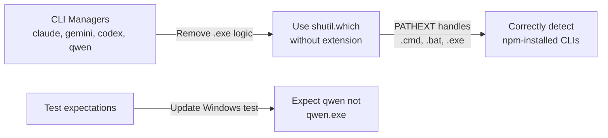

# fix: correct Windows CLI detection for npm-installed tools

You are working in a checked-out source repository. The upstream provenance (origin remote, project name, and commit identifiers) has been removed; solve the task from the working tree and the description below alone.

## Context (de-identified)

### **User description**
## Summary

Fixes CLI detection for Claude Code, Gemini CLI, Codex CLI, and Qwen CLI on Windows.

## Problem

The `is_client_installed()` method in these managers was incorrectly searching for `.exe` files on Windows:

```python
# Before (broken)
claude_executable = "claude.exe" if self._system == "Windows" else "claude"
return shutil.which(claude_executable) is not None
```

However, these CLI tools are installed via npm, which creates `.cmd` (and `.ps1`) wrapper scripts in `%APPDATA%\npm\`, not `.exe` files:

```
C:\Users\user\AppData\Roaming\npm\claude.CMD
C:\Users\user\AppData\Roaming\npm\gemini.CMD
C:\Users\user\AppData\Roaming\npm\codex.CMD
C:\Users\user\AppData\Roaming\npm\qwen.CMD
```

As a result, `shutil.which("claude.exe")` returns `None` even when Claude Code is properly installed.

## Solution

Remove the explicit `.exe` extension. Python's `shutil.which()` on Windows automatically uses the `PATHEXT` environment variable to find executables with any registered extension (`.COM`, `.EXE`, `.BAT`, `.CMD`, `.PS1`, etc.):

```python
# After (correct)
return shutil.which("claude") is not None
```

This works correctly because:
1. `PATHEXT` is a standard Windows environment variable present on all Windows versions since NT/2000
2. It typically contains: `.COM;.EXE;.BAT;.CMD;.VBS;.VBE;.JS;.JSE;.WSF;.WSH;.MSC;.CPL`
3. `shutil.which()` iterates through these extensions when searching for an executable without an explicit extension

## Changes

- `src/mcpm/clients/managers/claude_code.py` - Remove `.exe` suffix logic
- `src/mcpm/clients/managers/gemini_cli.py` - Remove `.exe` suffix logic
- `src/mcpm/clients/managers/codex_cli.py` - Remove `.exe` suffix logic
- `src/mcpm/clients/managers/qwen_cli.py` - Remove `.exe` suffix logic
- `tests/test_clients/test_qwen_cli.py` - Update Windows test to expect correct behavior

## Test Plan

- [x] Verified fix on Windows 11 with all four CLIs installed via npm
- [x] All existing tests pass
- [x] Updated Windows-specific test case

**Before fix:**
```
Claude Code: [X] Not found
Gemini CLI: [X] Not found
Codex CLI: [X] Not found
Qwen CLI: [X] Not found
```

**After fix:**
```
Claude Code: [OK] Installed
Gemini CLI: [OK] Installed
Codex CLI: [OK] Installed
Qwen CLI: [OK] Installed

Raw shutil.which results:
  claude: C:\Users\user\AppData\Roaming\npm\claude.CMD
  gemini: C:\Users\user\AppData\Roaming\npm\gemini.CMD
  codex: C:\Users\user\AppData\Roaming\npm\codex.CMD
  qwen: C:\Users\user\AppData\Roaming\npm\qwen.CMD
```

---

🤖 Generated with [Claude Code]([redacted-url])


___

### **PR Type**
Bug fix


___

### **Description**
- Remove incorrect `.exe` extension logic from Windows CLI detection

- Use `shutil.which()` which automatically handles Windows PATHEXT

- Fixes detection of npm-installed CLI tools (.cmd wrappers)

- Update test expectations for Windows CLI detection behavior


___

### Diagram Walkthrough





<details><summary><h3>File Walkthrough</h3></summary>

<table><thead><tr><th></th><th align="left">Relevant files</th></tr></thead><tbody><tr><td><strong>Bug fix</strong></td><td><table>
<tr>
  <td>
    <details>
      <summary><strong>claude_code.py</strong><dd><code>Remove .exe suffix from Claude CLI detection</code>&nbsp; &nbsp; &nbsp; &nbsp; &nbsp; &nbsp; &nbsp; &nbsp; &nbsp; &nbsp; &nbsp; &nbsp; &nbsp; </dd></summary>
<hr>

src/mcpm/clients/managers/claude_code.py

<ul><li>Remove conditional <code>.exe</code> extension logic for Windows<br> <li> Simplify to always call <code>shutil.which("claude")</code><br> <li> Add comment explaining PATHEXT automatic handling</ul>


</details>


  </td>
  <td><a href="[redacted-url]>+2/-2</a>&nbsp; &nbsp; &nbsp; </td>

</tr>

<tr>
  <td>
    <details>
      <summary><strong>gemini_cli.py</strong><dd><code>Remove .exe suffix from Gemini CLI detection</code>&nbsp; &nbsp; &nbsp; &nbsp; &nbsp; &nbsp; &nbsp; &nbsp; &nbsp; &nbsp; &nbsp; &nbsp; &nbsp; </dd></summary>
<hr>

src/mcpm/clients/managers/gemini_cli.py

<ul><li>Remove conditional <code>.exe</code> extension logic for Windows<br> <li> Simplify to always call <code>shutil.which("gemini")</code><br> <li> Add comment explaining PATHEXT automatic handling</ul>


</details>


  </td>
  <td><a href="[redacted-url]>+2/-2</a>&nbsp; &nbsp; &nbsp; </td>

</tr>

<tr>
  <td>
    <details>
      <summary><strong>codex_cli.py</strong><dd><code>Remove .exe suffix from Codex CLI detection</code>&nbsp; &nbsp; &nbsp; &nbsp; &nbsp; &nbsp; &nbsp; &nbsp; &nbsp; &nbsp; &nbsp; &nbsp; &nbsp; &nbsp; </dd></summary>
<hr>

src/mcpm/clients/managers/codex_cli.py

<ul><li>Remove conditional <code>.exe</code> extension logic for Windows<br> <li> Simplify to always call <code>shutil.which("codex")</code><br> <li> Add comment explaining PATHEXT automatic handling</ul>


</details>


  </td>
  <td><a href="[redacted-url]>+2/-2</a>&nbsp; &nbsp; &nbsp; </td>

</tr>

<tr>
  <td>
    <details>
      <summary><strong>qwen_cli.py</strong><dd><code>Remove .exe suffix from Qwen CLI detection</code>&nbsp; &nbsp; &nbsp; &nbsp; &nbsp; &nbsp; &nbsp; &nbsp; &nbsp; &nbsp; &nbsp; &nbsp; &nbsp; &nbsp; &nbsp; </dd></summary>
<hr>

src/mcpm/clients/managers/qwen_cli.py

<ul><li>Remove conditional <code>.exe</code> extension logic for Windows<br> <li> Simplify to always call <code>shutil.which("qwen")</code><br> <li> Add comment explaining PATHEXT automatic handling</ul>


</details>


  </td>
  <td><a href="[redacted-url]>+2/-2</a>&nbsp; &nbsp; &nbsp; </td>

</tr>
</table></td></tr><tr><td><strong>Tests</strong></td><td><table>
<tr>
  <td>
    <details>
      <summary><strong>test_qwen_cli.py</strong><dd><code>Update Windows CLI detection test expectations</code>&nbsp; &nbsp; &nbsp; &nbsp; &nbsp; &nbsp; &nbsp; &nbsp; &nbsp; &nbsp; &nbsp; </dd></summary>
<hr>

tests/test_clients/test_qwen_cli.py

<ul><li>Update Windows test to expect <code>shutil.which("qwen")</code> instead of <br><code>shutil.which("qwen.exe")</code><br> <li> Change mock return value from <code>.exe</code> path to <code>.cmd</code> path (npm wrapper)<br> <li> Add documentation comment explaining PATHEXT behavior<br> <li> Fix whitespace formatting (trailing spaces)</ul>


</details>


  </td>
  <td><a href="[redacted-url]>+16/-12</a>&nbsp; </td>

</tr>
</table></td></tr></tbody></table>

</details>

___


<!-- This is an auto-generated comment: release notes by coderabbit.ai -->
## Summary by CodeRabbit

* **Refactor**
  * Unified CLI installation detection across platforms and migrated configuration/data handling to Path-based, platform-aware directories.

* **New Features**
  * Added helpers to resolve standard config and data directories.

* **Bug Fixes**
  * Improved CLI/tool discovery and version checks with consistent error handling.

* **Tests**
  * Updated tests to reflect path and installation-detection changes.

<sub>✏️ Tip: You can customize this high-level summary in your review settings.</sub>
<!-- end of auto-generated comment: release notes by coderabbit.ai -->

## Goal

Make the change so that the project's regression tests pass. Do not edit the test files.
