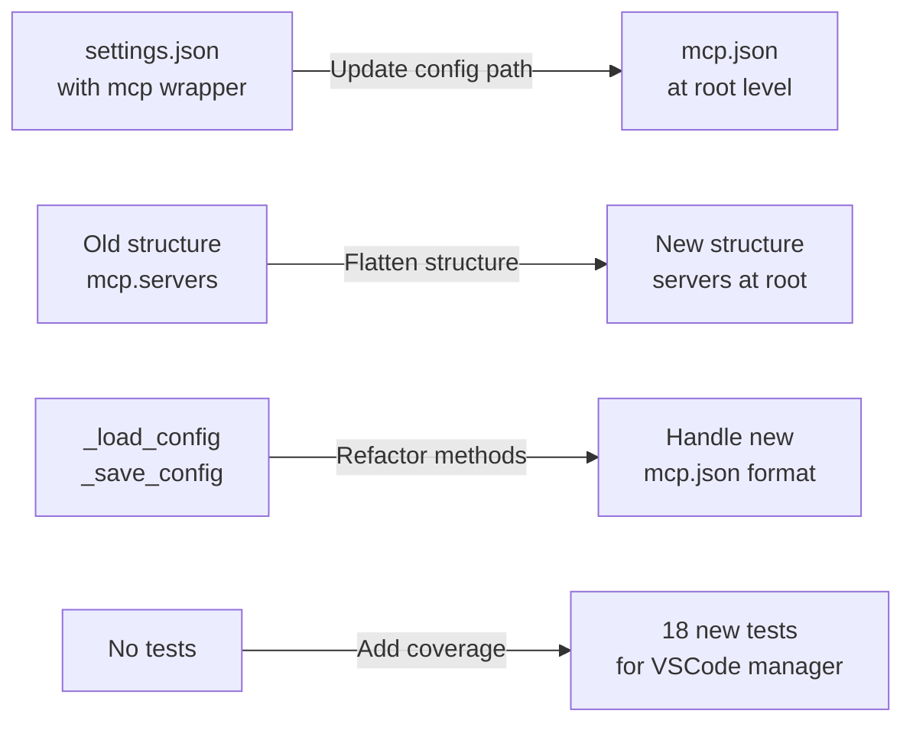

# fix: Update VSCode manager to use mcp.json with correct structure

You are working in a checked-out source repository. The upstream provenance (origin remote, project name, and commit identifiers) has been removed; solve the task from the working tree and the description below alone.

## Context (de-identified)

### **User description**
VSCode's MCP configuration was incorrectly targeting `settings.json` with config wrapped under an `mcp` key. Per [VS Code MCP docs]([redacted-url]), it should use a dedicated `mcp.json` file with `servers` at root level.

## Changes

- **Config paths**: Changed from `settings.json` to `mcp.json` for all platforms:
  - macOS: `~/Library/Application Support/Code/User/mcp.json`
  - Windows: `%APPDATA%/Code/User/mcp.json`  
  - Linux: `~/.config/Code/User/mcp.json`

- **Config structure**: Removed `mcp` wrapper in `_load_config()` and `_save_config()`:
  ```python
  # Before
  {"mcp": {"servers": {...}}}
  
  # After  
  {"servers": {...}, "inputs": []}
  ```

- **Added test coverage**: 18 tests for VSCode manager including platform-specific paths, config structure validation, and CRUD operations

> [!WARNING]
>
> <details>
> <summary>Firewall rules blocked me from connecting to one or more addresses (expand for details)</summary>
>
> #### I tried to connect to the following addresses, but was blocked by firewall rules:
>
> - `astral.sh`
>   - Triggering command: `/usr/bin/curl curl -LsSf REDACTED tests/test_run.py` (dns block)
>
> If you need me to access, download, or install something from one of these locations, you can either:
>
> - Configure [Actions setup steps]([redacted-url]) to set up my environment, which run before the firewall is enabled
> - Add the appropriate URLs or hosts to the custom allowlist in this repository's [Copilot coding agent settings]([redacted-url]) (admins only)
>
> </details>

<!-- START COPILOT ORIGINAL PROMPT -->


<details>

<summary>Original prompt</summary>

> ## Problem
> 
> The VS Code client manager in mcpm is currently configured to edit `settings.json` when it should be editing `mcp.json` according to the [VS Code MCP documentation]([redacted-url]).
> 
> Additionally, the configuration structure is incorrect - the `mcp` root key should be removed since `mcp.json` expects `servers` as the root key.
> 
> ## Changes Required
> 
> Update `src/mcpm/clients/managers/vscode.py` to:
> 
> 1. **Change config file paths** from `settings.json` to `mcp.json`:
>    - macOS: `~/Library/Application Support/Code/User/mcp.json`
>    - Windows: `%APPDATA%/Code/User/mcp.json`
>    - Linux: `~/.config/Code/User/mcp.json`
> 
> 2. **Update config structure** to match the mcp.json schema:
>    - Remove the `mcp` root key wrapping
>    - Have `servers` directly at the root level
>    - Support `inputs` array at root level (empty by default)
> 
> 3. **Update `_load_config()` method**:
>    - Remove logic that wraps/unwraps `mcp` key
>    - Return config with `servers` at root level
>    - Handle the simpler structure: `{"servers": {}, "inputs": []}`
> 
> 4. **Update `_save_config()` method**:
>    - Remove logic that nests config under `mcp` key
>    - Save config directly with `servers` at root
>    - Preserve `inputs` array if it exists
> 
> ## Expected Result
> 
> After the fix, the config file structure should be:
> 
> ```json
> {
>   "servers": {
>     "mcpm_profile_work": {
>       "type": "stdio",
>       "command": "mcpm",
>       "args": ["profile", "run", "work"]
>     }
>   },
>   "inputs": []
> }
> ```
> 
> Located in `~/Library/Application Support/Code/User/mcp.json` (on macOS) instead of `settings.json`.
> 
> ## References
> 
> - [redacted-ref]
> - VS Code MCP Documentation: [redacted-url]


</details>


<!-- START COPILOT CODING AGENT SUFFIX -->

*This pull request was created from Copilot chat.*
>

<!-- START COPILOT CODING AGENT TIPS -->
---

✨ Let Copilot coding agent [set things up for you]([redacted-url]) — coding agent works faster and does higher quality work when set up for your repo.


___

### **PR Type**
Bug fix, Tests


___

### **Description**
- Changed VSCode config file from `settings.json` to `mcp.json` per VS Code MCP docs

- Removed `mcp` root key wrapper, moved `servers` to root level

- Updated `_load_config()` and `_save_config()` to handle new structure

- Added comprehensive test suite with 18 tests for VSCode manager functionality


___

### Diagram Walkthrough





<details><summary><h3>File Walkthrough</h3></summary>

<table><thead><tr><th></th><th align="left">Relevant files</th></tr></thead><tbody><tr><td><strong>Bug fix</strong></td><td><table>
<tr>
  <td>
    <details>
      <summary><strong>vscode.py</strong><dd><code>Update VSCode config to use mcp.json with correct structure</code></dd></summary>
<hr>

src/mcpm/clients/managers/vscode.py

<ul><li>Changed config file paths from <code>settings.json</code> to <code>mcp.json</code> for all <br>platforms (Windows, macOS, Linux)<br> <li> Removed <code>mcp</code> root key wrapping in <code>_load_config()</code> method, now returns <br>config with <code>servers</code> at root level<br> <li> Updated <code>_save_config()</code> to save config directly without nesting under <br><code>mcp</code> key<br> <li> Added support for <code>inputs</code> array at root level per VS Code MCP <br>specification<br> <li> Simplified config structure handling and improved docstrings</ul>


</details>


  </td>
  <td><a href="[redacted-url]>+25/-27</a>&nbsp; </td>

</tr>
</table></td></tr><tr><td><strong>Tests</strong></td><td><table>
<tr>
  <td>
    <details>
      <summary><strong>test_vscode.py</strong><dd><code>Add comprehensive test suite for VSCode manager</code>&nbsp; &nbsp; &nbsp; &nbsp; &nbsp; &nbsp; &nbsp; &nbsp; &nbsp; &nbsp; </dd></summary>
<hr>

tests/test_clients/test_vscode.py

<ul><li>Added 18 comprehensive tests for VSCodeManager covering <br>platform-specific config paths (macOS, Windows, Linux)<br> <li> Tests validate correct config structure with <code>servers</code> at root level and <br><code>inputs</code> array<br> <li> Added tests for CRUD operations: <code>add_server()</code>, <code>get_server()</code>, <br><code>remove_server()</code>, <code>list_servers()</code><br> <li> Added tests for format conversion methods <code>to_client_format()</code> and <br><code>from_client_format()</code><br> <li> Included edge case tests for empty configs, invalid JSON, missing <br>files, and config migration compatibility</ul>


</details>


  </td>
  <td><a href="[redacted-url]>+336/-0</a>&nbsp; </td>

</tr>
</table></td></tr></tbody></table>

</details>

___

## Goal

Make the change so that the project's regression tests pass. Do not edit the test files.
